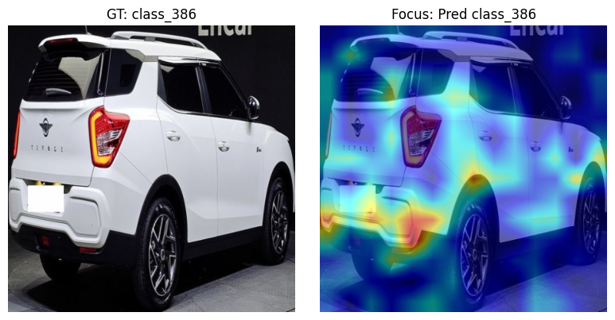

# 🚗 Car Classification with ConvNeXt / EVA02

A deep learning pipeline for classifying car images using ConvNeXt and EVA02 models.

> ⚠️ This repository is part of my **personal research and archival work**.  
> It documents experiments and code developed during participation in the **Hecto AI Challenge 2025**.

---

## 📖 Overview

This project was created for the **Hecto AI Challenge 2025**

The objective was to classify car types from images using state-of-the-art vision models and advanced training techniques.

---

## 💡 Key Learnings from the Competition

- ⚠️ **I-JEPA representations** didn’t perform well in this task — likely due to my limited experience applying it to classification tasks, rather than a flaw in the method itself.
- ✅ **Temperature Scaling** was useful for calibrating logits and improving log-loss.
- 💎 **EVA-02 with RoPE (Rotary Position Embedding)** showed strong performance and robustness.

---

## 🚀 Features

- ✅ ConvNeXtV2 and EVA02 support via `timm`
- ✅ CutMix augmentation
- ✅ Focal Loss for handling class imbalance
- ✅ EMA (Exponential Moving Average) for stable training
- ✅ Mixed-precision training with AMP
- ✅ YAML-based configuration system

---

## 🧩 Folder Structure

```
car-classification/
├── configs/
│   └── config.yaml              # Training configuration
├── figures/
│   └── project03.png            # Grad-CAM visualization
├── models/
│   └── __init__.py             # Model builder
├── utils/
│   ├── augment.py
│   ├── ema.py
│   ├── losses.py
│   └── plot.py
├── data/
│   └── dataset.py
├── scripts/
│   └── train.py
│   └── inference.py 
├── requirements.txt
└── README.md
```

---

## 🏃 Getting Started

### 1. Install dependencies

```bash
pip install -r requirements.txt
```

### 2. Set up the config file
configs/config.yaml:

```yaml
# Dataset & Paths
dataset: hecto25
val_split: 2.0e-1
save_path: best_model_ema.pth
plot_path: loss_curve.png

# Image & Batch Settings
img_size: 448
batch_size: 32

# Model
model_name: convnextv2_huge

# Training
epochs: 50
lr: 5.0e-6
weight_decay: 1.0e-2
patience: 10

# Grad-CAM settings
gradcam: true
target_layer: model.stages[3].blocks[-1]
```

### 3. Train the model

```bash
python scripts/train.py --config configs/config.yaml
```

---

## 📊 Example Result

<p align="center">
  
</p>

> Grad-CAM highlights the regions that guided the model's decision.

---

## 🤝 License

MIT License
